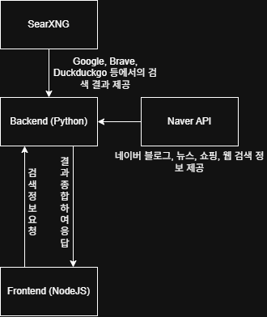

> 현재 개발 중인 프로젝트입니다. 상당 부분이 현재 미구현 되어있으니 오류 시 상세한 정보 제공이 어렵습니다.


# Research

Visionary Local Search Engine

## Features

- SearXNG 기반 웹 검색
- Naver 웹 검색 API 연동
- Docker 기반 client-server 연동

## Stack

- Python 3.11
  - FastAPI
  - httpx
- Docker
  - docker-compose
- SearXNG
- NodeJS
  - React
  - Typescript

## Diagram



## Installation

### 1. Clone

```bash
git clone https://github.com/holy0unjinx/research.git

cd research
```

### 2. Environment

Make `.env` file on `backend/`

```ini
# https://developers.naver.com/main/를 참고하여 작성하세요.
# backend/example.env 파일을 참고하시오.

NAVER_CLIENT_ID=
NAVER_CLIENT_SECRET=
```

### 3. Run Docker

```bash
docker compose up -d
```

### Usage

http://localhost:3000 에서 Frontend가 실행됩니다. 백엔드는 8000포트 입니다.

## LICENSE

MIT LICENSE입니다. LICENSE 파일을 참고해 주세요.
